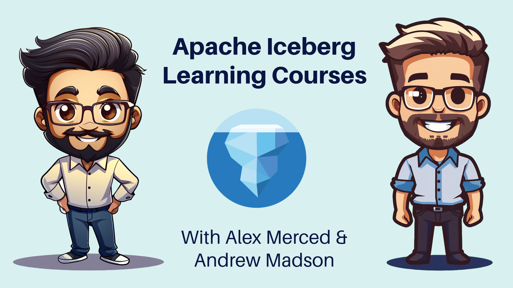

# Apache Iceberg Linked In Learning Resources

- [Free Copy of Apache Iceberg the Definitive Guide](https://hello.dremio.com/wp-apache-iceberg-the-definitive-guide-reg.html?utm_source=linkedincourse&utm_medium=linkedincourse&utm_campaign=linkedincourse&utm_id=linkedincourse&utm_term=linkedincourse&utm_content=linkedincourse)

## Instructors

- [Alex Merced](https://bio.alexmerced.com/data)
- [Andrew Madson](https://www.linkedin.com/in/andrew-madson/)

## Curriculum

### Course 1 - Fundamentals of Apache Iceberg

[Course Readme](/course-1/)

### Course 2 - Hands-On with Apache Iceberg

[Course Readme](/course-2/)

### Course 3 - Machine Learning & AI with Iceberg

[Course Readme](/course-3/)

### Course 4 - DataOps with Apache Iceberg using Spark, Nessie, and Dremio

[Course Readme](/course-4/)
